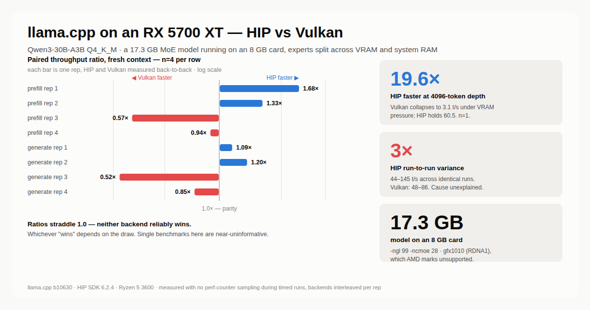

<div align="center">
  <picture>
    <source media="(prefers-color-scheme: dark)" srcset="assets/hero-dark.png">
    <source media="(prefers-color-scheme: light)" srcset="assets/hero-light.png">
    
  </picture>
</div>

# llama.cpp on gfx1010 (RX 5700 XT)

Build scripts, runtime probes and a benchmark harness for running **HIP/ROCm llama.cpp on a
Radeon RX 5700 XT** — a card AMD's support matrix marks unsupported, whose prebuilt "win-hip"
binaries silently report zero devices, and which ROCm-on-WSL2 does not cover.

It works. A 17.3 GB Qwen3-30B-A3B MoE model runs on the 8 GB card with experts split across
VRAM and system RAM, at roughly 12–17 t/s generation.

## What's here

| | |
|---|---|
| `build-hip-gfx1010.ps1` | Builds llama.cpp b10630 with `-DGGML_HIP=ON -DGPU_TARGETS=gfx1010`, working around three build failures that are not obvious (below). |
| `swap-rocblas-gfx1010.ps1` | Swaps in community rocBLAS carrying `gfx1010:xnack-` Tensile kernels. Reversible — keeps `.orig` backups. |
| `hip_probe.py`, `hip_arch_probe.py` | Call `hipGetDeviceCount` / device props through ctypes. These are what disproved "ROCm can't see this card" and established the exact arch string. |
| `verify/c3fix/` | The HIP-vs-Vulkan measurement harness (`c3-fix.sh`, `c3-fresh.sh`), its analysis (`analyze.py`) and the measured data (`results.csv`). |
| `FINDINGS.md` | Full results, the reasoning, and the mistakes made getting there. |
| `assets/make_hero.py` | Regenerates the chart above from `results.csv`, so it can't drift from the data. |

## Requirements

- **Windows** (10/11), native — not WSL2, which exposes no `/dev/kfd`.
- **AMD HIP SDK 6.2.4**. Match it to your driver's HIP runtime (`C:\Windows\System32\amdhip64_6.dll`);
  a mismatch is the actual reason prebuilt HIP binaries report zero devices.
- **Visual Studio 2022 Build Tools** (MSVC + Windows SDK), **CMake**, and **Git for Windows** —
  the last one because `hipconfig` is a Perl script and Git bundles perl.
- Community rocBLAS for `gfx1010:xnack-` ([likelovewant/ROCmLibs](https://github.com/likelovewant/ROCmLibs-for-gfx1103-AMD780M-APU), v0.6.2.4).

> ⚠️ The HIP SDK's silent installer **replaces your display driver** despite AMD's docs saying
> otherwise — here Adrenalin 24.12.1 → PRO Edition 24.Q4. Run the installer interactively if
> that matters to you.

## Quick start

```powershell
# 1. rocBLAS with gfx1010 kernels (elevated shell — writes under Program Files)
.\swap-rocblas-gfx1010.ps1

# 2. build (~15 min, 514 steps)
.\build-hip-gfx1010.ps1

# 3. confirm the GPU is actually seen
.\hip-gfx1010\llama-cli.exe --list-devices
#    -> ROCm0: AMD Radeon RX 5700 XT (8176 MiB, 8035 MiB free)

# 4. run a 17.3 GB model on the 8 GB card
.\hip-gfx1010\llama-cli.exe -m <model.gguf> -ngl 99 -ncmoe 28 -c 8192
```

`-ncmoe N` = how many of the 48 MoE layers compute their experts on CPU. `28` is the setting
with the most GPU-resident experts that still fits; `24` fails to load.
**Always pass `-c`** — the default is the model's `n_ctx_train` (262144 here), which will not fit.

## The three build failures

Each of these produces a confusing error rather than a useful one:

1. **PowerShell aborts on CMake's benign stderr.** `$ErrorActionPreference = "Stop"` treats
   CMake's `CMAKE_BUILD_TYPE=Release` status line as fatal. Use `Continue` and check `$LASTEXITCODE`.
2. **`Unexpected HIP_PLATFORM:`** — `hip-config.cmake` shells out to `hipconfig`, a **Perl**
   script. With no perl on `PATH` it returns empty. Pass `-DHIP_PLATFORM=amd` and append Git's
   `usr\bin` to `PATH` (append *last* — it also contains a GNU `link.exe` that would shadow MSVC's).
3. **`unknown type name '__hip_fp8_e4m3'`** — llama.cpp aliases it under `HIP_VERSION >= 60200000`,
   but SDK 6.2.4 ships only the `_fnuz` variants. Guard the typedef at `>= 60300000`; it is only
   used by CUDA/Blackwell-only branches.

## Results, honestly

The headline is **not** "HIP is faster". Across four paired reps at `-ncmoe 28` with fresh
context, the HIP/Vulkan ratio was 1.68, 1.33, 0.57, 0.94 — it **straddles 1.0**, so neither
backend reliably wins and a single benchmark tells you almost nothing.

What *is* stable:

- **HIP throughput varies ~3× run-to-run** on identical config (44–145 t/s); Vulkan is far more
  predictable (48–86). The cause is **unexplained** — the Windows HIP SDK ships no `rocm-smi`,
  so clocks, power and temperature are unobservable.
- **VRAM pressure, not the backend, decides at long context.** At `-ncmoe 28` with 4096 tokens
  of context, Vulkan collapses to 3.1 t/s while HIP holds 60.5 (19.6×) — ~20 GPU-resident expert
  layers plus the KV cache exceed 8 GB. At `-ncmoe 32` there is headroom and Vulkan wins fresh
  context instead. *(n=1 — directional, not established.)*
- **Kernels are numerically sound**: perplexity 8.6288 (GPU) vs 8.6724 (CPU) over 4096 tokens,
  −0.50%. Caveat: `test-backend-ops` shows 36 bf16 `FLASH_ATTN_EXT` cases failing against the
  CPU reference — these models don't enter that path, but an unofficially-supported GPU earns
  the scrutiny.
- **The community rocBLAS swap is not load-bearing** for Q4_K_M inference — a kernel-dispatch
  capture showed 7,807 dispatches with **zero** rocBLAS/Tensile calls; everything goes through
  ggml's own MMQ kernels. Whether stock rocBLAS would link is untested, so keep doing the swap.

### Measurement pitfalls worth stealing

Two mistakes here produced confident, wrong answers before being caught:

- **Sampling perf counters during a timed run** suppressed HIP prefill by ~21% on a 6-core box
  (the sampler competes with the MoE expert threads) and yielded a tidy "the backends are within
  0.8%" conclusion that was pure instrument artifact.
- **Two GPU jobs at once** on an 8 GB card produce `ErrorOutOfDeviceMemory` and HIP access
  violations that look exactly like driver bugs.

`verify/c3fix/` avoids both: nothing samples during timed runs, and backends are interleaved
*within* each rep (alternating which goes first) so drift cancels in the paired ratio.

## Reproducing the benchmark

```bash
cd verify/c3fix
REPS=4 NCMOE_LIST="28 32" ./c3-fix.sh   # both context depths
python3 analyze.py                      # distributions + paired ratios
```

`analyze.py` reports a per-cell spread and prints **`NO RELIABLE WINNER`** where the paired
ratios straddle 1.0, rather than averaging them into a number that hides it.

## License

The scripts here are MIT. llama.cpp, ROCm and the community rocBLAS builds carry their own licenses.
